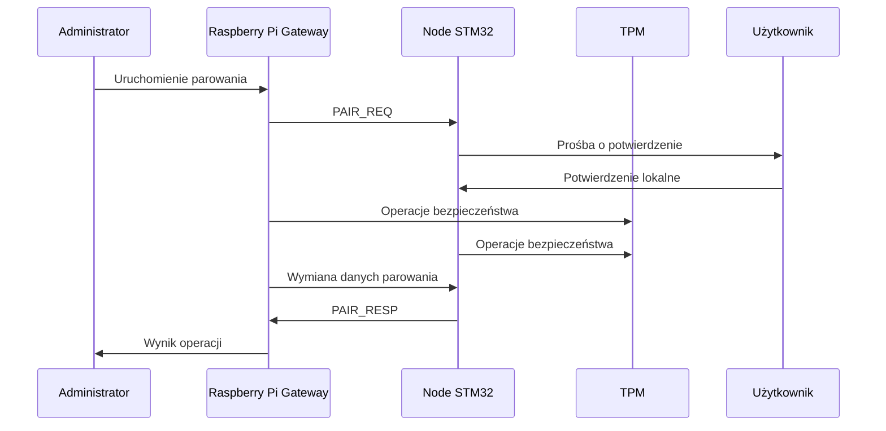
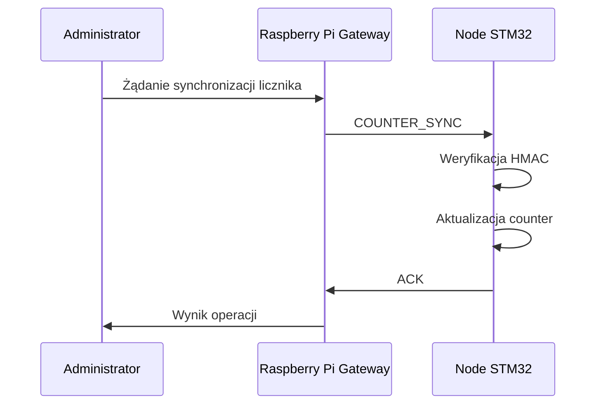
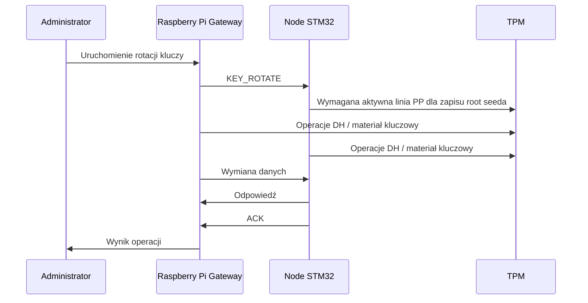

# BEKO Pager Network (`pager-rtos`)

## 1. Opis systemu

BEKO to bezprzewodowy system pagerowy pracujący w topologii **gwiazdy**.  
W systemie występuje:

- jeden węzeł centralny: **Raspberry Pi Gateway**,
- adresy node’ów STM32 w zakresie `0x0002..0xFFFE`,
- komunikacja radiowa przez obecny backend **SX1276/RFM95**.

Firmware noda przechowuje obecnie do **15 zaufanych urządzeń** w lokalnych
slotach trusted storage. Nie jest to limit adresacji radiowej.

Gateway wysyła wiadomości do wybranego node’a albo do całej sieci.  
Każda poprawnie odebrana wiadomość z gatewaya musi zostać potwierdzona przez node ramką `ACK`.

---

## 2. Adresacja

Adresacja w ramce `LAVIET_FRAME_V1` jest 16-bitowa:

- `0x0000` – wartość nieważna,
- `0x0001` – Raspberry Pi Gateway,
- `0x0002..0xFFFE` – adresy node’ów,
- `0xFFFF` – broadcast.

W systemie może działać:

- **1 gateway**,
- wiele urządzeń końcowych w zakresie adresów `0x0002..0xFFFE`,
- aktualnie do **15 sparowanych wpisów trusted** na jednym nodzie.

---

## 3. Role użytkowników

W systemie przewidziane są cztery role:

### Administrator
Ma pełny dostęp do systemu.  
Może zmieniać konfigurację gatewaya i node’ów, zarządzać parowaniem, licznikami bezpieczeństwa, kluczami i ustawieniami krytycznymi.  
Dostęp wymaga podania odpowiedniego PIN-u administratora.

### Operator
Ma ograniczony dostęp administracyjny.  
Może wykonywać działania, które nie naruszają integralności całego systemu, np. wysyłać wiadomości, zmieniać wybrane ustawienia użytkowe i obsługiwać system operacyjnie.

### Użytkownik
Ma dostęp tylko do podstawowych funkcji node’a.  
Może odczytać wiadomość, wysłać odpowiedź przyciskami i korzystać z urządzenia w normalnym trybie pracy.

### Serwisant
Ma fizyczny dostęp do urządzenia.  
Może podłączyć się do node’a lub gatewaya w celu diagnostyki, odczytu logów, testów i czynności serwisowych.  
Dostęp serwisowy powinien być kontrolowany i logowany.

---

## 4. Ochrona ustawień lokalnych

Każdy node posiada lokalny tryb konfiguracji.  
Dostęp do ustawień wymaga podania **4-cyfrowego PIN-u**.

PIN:

- chroni lokalną konfigurację,
- może zostać zmieniony,
- nie może być przechowywany w postaci jawnej.

Powinien być przechowywany w postaci zabezpieczonej, np. jako wartość chroniona z użyciem HMAC lub materiału powiązanego z TPM.

PIN służy do kontroli dostępu, a nie jako główny sekret kryptograficzny systemu.

---

## 5. Ramka `LAVIET_FRAME_V1`

System wykorzystuje zwartą ramkę aplikacyjną `LAVIET_FRAME_V1`.

### Struktura ramki

- `ver_type` – 1 B
- `flags` – 1 B
- `src_id` – 2 B
- `dst_id` – 2 B
- `msg_id` – 2 B
- `counter` – 4 B
- `payload_len` – 1 B
- `payload` – 0–16 B
- `mac_tag` – 32 B

### Rozmiar ramki

Część stała zajmuje:

- 1 + 1 + 2 + 2 + 2 + 4 + 1 + 32 = **45 B**

Całkowity rozmiar ramki:

- minimum: **45 B**
- maksimum: **61 B**

Ramka mieści się w limicie 64 B i zostawia **3 B rezerwy**.

---

## 6. Znaczenie pól `ver_type` i `flags`

### `ver_type`
Pole 1-bajtowe:

- starsze 4 bity – wersja protokołu,
- młodsze 4 bity – typ wiadomości.

Przykładowe typy:

- `0x1` – `DATA`
- `0x2` – `ACK`
- `0x3` – `RESP`
- `0x4` – `PAIR_REQ`
- `0x5` – `PAIR_RESP`
- `0x6` – `CFG`
- `0x7` – `COUNTER_SYNC`
- `0x8` – `KEY_ROTATE`
- `0x9` – `ERROR`

### `flags`
Pole 1-bajtowe:

- bit 0 – `ENCRYPTED`
- bit 1 – `ACK_REQUIRED`
- bit 2 – `IS_ACK`
- bit 3 – `PAIRING`
- bit 4 – `CONFIG_ACCESS`
- bit 5 – `BROADCAST`
- bit 6 – `COUNTER_OVERRIDE`
- bit 7 – `KEY_UPDATE`

---

## 7. Zabezpieczenia

System chroni:

- poufność wiadomości,
- integralność ramek,
- autentyczność nadawcy,
- licznik anti-replay,
- konfigurację urządzenia,
- klucze kryptograficzne.

### HMAC-SHA256

Każda ramka zawiera `mac_tag` o długości **32 B**.  
Do uwierzytelniania i kontroli integralności używany jest **HMAC-SHA256**.

HMAC liczony jest po:

`ver_type || flags || src_id || dst_id || msg_id || counter || payload_len || payload`

Firmware inicjalizuje bloki **CRYP/HASH/RNG** STM32U545 i nie uruchamia ruchu secure, jeśli CRYP/HASH nie zgłoszą gotowości. `laviet_crypto` zachowuje portable ścieżkę obliczeń jako referencję zgodności formatu ramki; backend można dalej przepiąć na pełne wywołania HAL bez zmiany kontraktu `LAVIET_FRAME_V1`.

### Szyfrowanie wiadomości

Payload wiadomości szyfrowany jest w trybie:
- **AES-CTR**

Zalety:

- brak paddingu,
- ciphertext ma taką samą długość jak plaintext,
- dobrze pasuje do krótkiego payloadu 0–16 B.

Jeżeli flaga `ENCRYPTED` jest ustawiona, odbiornik musi:

1. zweryfikować HMAC,
2. sprawdzić licznik `counter`,
3. dopiero wtedy odszyfrować payload.

---

## 8. TPM i klucze

TPM jest głównym punktem zaufania w systemie.

Wszystkie operacje bezpieczeństwa, które mogą być wykonane w TPM i które są wspierane w przyjętej architekturze, powinny być wykonywane właśnie tam.

TPM jest używany do:

- przechowywania sekretu głównego urządzenia,
- ochrony kluczy,
- generowania danych losowych,
- ochrony sekretów EEPROM,
- wsparcia lokalnej rotacji root seeda.

Aktualny lifecycle sekretu:

1. Przy starcie firmware inicjalizuje TPM przed storage.
2. Root seed jest odczytywany z TPM NV.
3. Główny, PP-protected index to `0x01C10101`.
4. Starszy index `0x01C10100` jest odczytywany tylko jako ścieżka migracyjna.
5. Jeśli seed musi zostać utworzony albo nadpisany, zapis do TPM NV wymaga aktywnego pinu **TPM PP**.
6. Pin PP jest podłączony do samego TPM, pin `7`, aktywny stanem `VDD`; nie jest odczytywany jako GPIO STM32.
7. Klucz szyfrowania sekretów EEPROM jest wyprowadzany z TPM-backed root seeda.

Index `0x01C10101` jest definiowany z `PPWRITE`, `OWNERREAD` i `NO_DA`.
W praktyce rotacja klucza z menu `Security -> Keys` wymaga trzymania
przycisku TPM PP; bez tego UI pokaże `Hold TPM PP button`.

Klucze nie mogą być przechowywane w firmware w postaci jawnej.  
Są wyprowadzane lub ładowane bezpiecznie przy starcie, a następnie używane tylko tymczasowo.

---

## 9. Anti-replay i synchronizacja licznika

Każda ramka zawiera pole `counter` o długości 4 B.

Licznik:

- rośnie monotonicznie,
- służy do ochrony przed replay,
- jest sprawdzany po stronie odbiorcy.

Gateway może wysłać specjalną wiadomość `COUNTER_SYNC`, aby nadpisać licznik node’a.  
Do tego celu używana jest flaga `COUNTER_OVERRIDE`.

Taka operacja:

- jest dostępna tylko dla gatewaya,
- musi być zabezpieczona HMAC,
- powinna być logowana.

---

## 10. Parowanie i rotacja kluczy

### Parowanie

Parowanie odbywa się wyłącznie z gatewayem. Próg RSSI `-20 dBm` jest traktowany jako ostrzeżenie diagnostyczne do walidacji praktycznej, a nie jako twarda blokada w pierwszym wdrożeniu.

Przebieg:

1. Gateway wysyła `PAIR_REQ`.
2. Node przechodzi w tryb parowania.
3. Użytkownik lokalnie potwierdza operację.
4. TPM wspiera ustanowienie materiału kryptograficznego.
5. Zapisywana jest relacja zaufania.
6. Wyprowadzane są klucze robocze.

### Rotacja kluczy

System powinien wspierać rotację kluczy z użyciem **Diffie–Hellman**.

Rotacja może być uruchamiana:

- okresowo,
- po określonej liczbie wiadomości,
- na żądanie administratora,
- po incydencie bezpieczeństwa.

Lokalna rotacja root seeda na nodzie jest już zabezpieczona TPM PP.
Radiowy protokół `KEY_ROTATE` i docelowa wymiana DH/ECDH nadal wymagają
dokończenia jako osobny przepływ.

---

## 11. Logi UART i kontrola startu

Podczas uruchamiania urządzenia przez UART powinny być wypisywane informacje o inicjalizacji:

- MCU,
- TPM,
- SX1276/RFM95,
- wyświetlacza,
- przycisków,
- LED,
- EEPROM,
- materiału kluczowego,
- konfiguracji bezpieczeństwa,
- zgodności firmware.

Dodatkowo czasy inicjalizacji ważnych modułów powinny być mierzone.  
Jeżeli któryś element uruchamia się poza oczekiwanym zakresem czasowym, system powinien zgłosić anomalię na UART.

---

## 12. Główny graf systemu

```mermaid
graph TD
    A["Administrator"] --> WEB["Panel / interfejs systemu"]
    O["Operator"] --> WEB
    U["Użytkownik"] --> NODE["Node STM32"]
    A --> NODE
    S["Serwisant"] --> DEV["Dostęp fizyczny / UART / serwis"]

    WEB --> GW["Raspberry Pi Gateway"]

    GW --> N1["Node STM32 #1"]
    GW --> N2["Node STM32 #X"]
    GW --> N3["Node STM32 #15 trusted"]

    N1 --> UI1["Wyświetlacz"]

    N2 --> UI2["Wyświetlacz"]

    N3 --> UI3["Wyświetlacz"]

    DEV --> GW
    DEV --> N2
````

---

## 13. Główne przepływy komunikacji

### Zwykła wiadomość z ACK

```mermaid
sequenceDiagram
    participant O as Operator / Administrator
    participant GW as Raspberry Pi Gateway
    participant N as Node STM32
    participant U as Użytkownik

    O->>GW: Wysłanie wiadomości
    GW->>GW: Budowa ramki
    GW->>GW: AES-CTR payload
    GW->>GW: HMAC-SHA256
    GW->>N: DATA
    N->>N: Weryfikacja HMAC i counter
    N->>N: Odszyfrowanie payloadu
    N->>U: Wyświetlenie wiadomości
    N->>GW: ACK
    GW->>O: Wynik operacji
```

### Parowanie



### Synchronizacja licznika



### Rotacja kluczy


